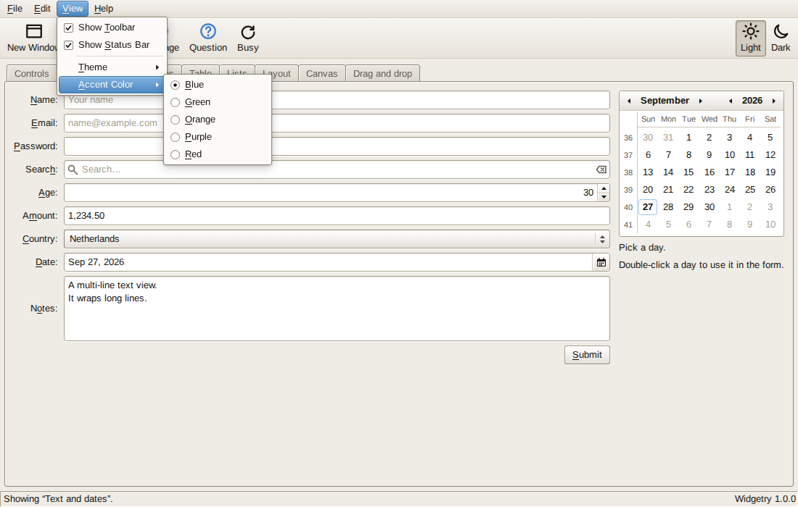
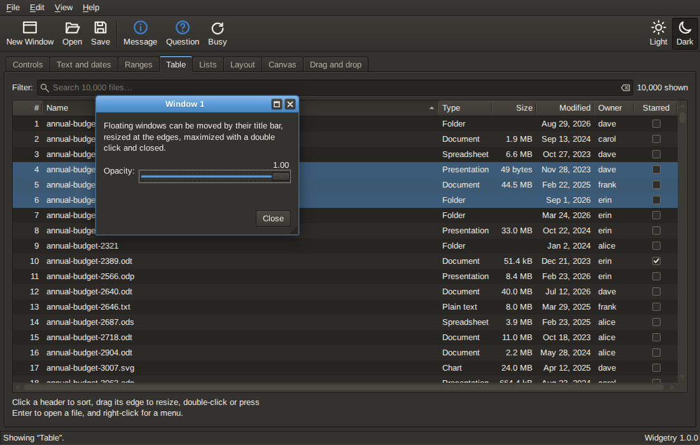

# Widgetry

**A desktop-style widget toolkit for the browser, in the spirit of GTK and the classic Clearlooks
theme.**

Widgetry builds applications that look and behave like desktop software: windows you can move,
resize and maximize, menu bars with keyboard navigation and shortcuts, toolbars, dialogs, tables
with a hundred thousand rows, form controls, drag and drop, and a layout model where widgets have
natural sizes, expand and align, just like in GTK. It has no dependencies.

- **Demo:** <https://gerbenvv.github.io/widgetry/>. Or open [`demo/index.html`](demo/index.html)
  in a browser (no server or build needed), or run `npm run serve` and visit
  <http://127.0.0.1:8080/demo/>.
- **Embedding:** [`demo/embedded.html`](demo/embedded.html) shows an application inside an
  ordinary web page.
- **Documentation:** this README, [`docs/architecture.md`](docs/architecture.md),
  [`docs/builder.md`](docs/builder.md) and [`docs/i18n.md`](docs/i18n.md), the JSDoc comments of
  the sources (also in the TypeScript declarations), and the [changelog](CHANGELOG.md).



## Features

- **Widgets:** windows, dialogs and message dialogs, menu bars, menus and context menus, toolbars,
  tooltips, popovers, buttons (push, toggle, check, radio, link and menu buttons), switches, color
  buttons with a color chooser (a palette and an editor), labels with markup and mnemonics, text
  entries with validation and icons, multi-line text, spin buttons, combo boxes, calendars and
  date entries, sliders, scroll bars, progress bars and throbbers, images, frames, grids, boxes,
  fixed positioning, panes, notebooks (tabs), expanders, scroll areas, button boxes, status bars,
  info bars, list boxes of any widgets (with selection, filtering, sorting, headers and model
  binding), a virtualized table with sortable and resizable columns that is also a tree view, and
  a vector canvas with interactive shapes.
- **GTK's layout model on CSS:** natural and minimum sizes, `hExpand`/`vExpand` (inherited from the
  children), `hAlign`/`vAlign`, margins and size requests, laid out with CSS flexbox and grid.
- **Keyboard first:** focus handling per window, Tab navigation, mnemonics (Alt+letter),
  accelerators (Ctrl+S), menu and table navigation, and ARIA roles throughout.
- **An object model with properties and signals:** every property emits a change signal, and every
  widget can be created from a plain object or JSON with the builder.
- **Data:** list and tree models with sorting, filtered models that stay in sync, selections,
  filters and validators.
- **Navigation:** a navigator that keeps the location hash in sync with the application, for
  bookmarks and the back button.
- **Internationalization:** locale-aware formatting and parsing of numbers and dates, and a
  translator with plural forms, all based on `Intl`.
- **Theming:** the classic Clearlooks look in a light and a dark variant (or following the system),
  with a configurable accent color, all through CSS custom properties, and freedesktop-named
  icons.
- **Modern packaging:** ES modules, a classic script build, TypeScript declarations, and no
  dependencies.



## Installation

```bash
npm install widgetry
```

Or use the files in [`dist/`](dist/) directly: `widgetry.js` (an ES module), `widgetry.min.js` (a
classic script that defines the global `widgetry`) and `widgetry.css`.

## Quick start

```html
<link rel="stylesheet" href="node_modules/widgetry/dist/widgetry.css" />

<script type="module">
    import { Box, Button, Label, MainWindow, Orientation, alert } from 'widgetry';

    const window = new MainWindow({ title: 'Hello' });
    const box = new Box({ orientation: Orientation.VERTICAL, spacing: 6, margin: 12 });

    const button = new Button({ label: '_Say hello', useUnderline: true, hAlign: 'center' });
    button.connect('activate', () => alert('Hello, world!'));

    box.addChild(new Label({ text: 'Widgetry says:' }));
    box.addChild(button);

    window.addChild(box);
    window.show();
</script>
```

With a bundler, import the stylesheet as `widgetry/widgetry.css`. Without one, use the classic
script and the global:

```html
<link rel="stylesheet" href="dist/widgetry.css" />
<script src="dist/widgetry.min.js"></script>
<script>
    const window = new widgetry.MainWindow({ title: 'Hello' });
    window.addChild(new widgetry.Label({ text: 'Hello, world!' }));
    window.show();
</script>
```

A `MainWindow` fills the page by default. To embed an application in a page, give it a `host`
element: `new MainWindow({ host: document.querySelector('#app') })`.

## Concepts

### Properties and signals

Widgets are configured with properties, passed to the constructor or set later. Setting a property
to a new value emits `<name>-change`:

```js
const check = new CheckBox({ label: 'Remember me', active: true });

check.connect('active-change', () => console.log(check.active));
check.active = false;
```

`connect()` returns a function that disconnects again. Widgets also emit their own signals, such as
`activate` when the user activates a button, menu item or toggle, `toggle` on every change of a
toggle's `active` (also from code), `response` for dialogs and `row-activate` for tables. A handler
that returns `true` marks a signal as handled.

### Layout

Containers lay out their children the way GTK does. A `Box` places them in a row or column with
`spacing`; a `Grid` in rows and columns with spans; a `Paned` side by side with a splitter; a
`Notebook` on tabs. Every widget has a natural size. `hExpand` and `vExpand` make it take extra
space (a container expands when one of its children does), and `hAlign` and `vAlign`
(`'fill'`, `'start'`, `'center'` or `'end'`) position it in its space.

```js
const row = new Box({ spacing: 6 });

row.addChild(new Label({ text: 'Name:' }));
row.addChild(new LineEdit({ hExpand: true }));
row.addChild(new Button({ label: 'Save' }));
```

### Windows, dialogs and focus

`Window` floats above the main window; the user can move, resize, maximize and close it. Each
window remembers which widget has the focus. `Dialog` adds a content area and response buttons, and
`run()` returns a promise:

```js
const dialog = new Dialog({ title: 'Delete file?', modal: true });

dialog.addChild(new Label({ text: 'The file will be deleted permanently.' }));
dialog.addButton(Response.CANCEL);
dialog.addButton(Response.OK, '_Delete');

if ((await dialog.run()) === Response.OK) {
    deleteFile();
}
```

For the common cases there are `alert()`, `confirm()` and `prompt()`. An `InfoBar` shows a message
above content in a window, with response buttons like a dialog's.

### Menus, toolbars and shortcuts

```js
const menu = new Menu();
const save = new MenuItem({ label: '_Save', icon: 'document-save', accelerator: 'Ctrl+S' });

save.connect('activate', saveDocument);
menu.addChild(save);

const menuBar = new MenuBar();
menuBar.addChild(new MenuItem({ label: '_File', submenu: menu }));
```

Accelerators work anywhere in the window. `attachContextMenu(widget, menu)` adds a context menu. A
`ToolBar` holds tool items (`ToolItem`, `CheckToolItem`, `RadioToolItem` and
`SeparatorToolItem`) and moves the ones that do not fit into an overflow menu. Icons use
freedesktop names (`document-open`, `edit-copy`, ...); see `getIconNames()`, and add your
own with `registerIcon()`.

### Tables, trees and models

```js
const model = new ListModel({ rows, idColumn: 'id', sortColumn: 'name' });
const table = new Table({ model, selectionMode: SelectionMode.MULTIPLE });

table.addColumn(new TextColumn({ name: 'name', label: 'Name', expand: true }));
table.addColumn(new NumberColumn({ name: 'size', label: 'Size', digits: 0 }));
table.addColumn(new DateColumn({ name: 'modified', label: 'Modified', format: 'date' }));
table.addColumn(new CheckBoxColumn({ name: 'starred', label: 'Starred', editable: true }));

table.connect('row-activate', (_table, index) => openRow(model.getRow(index)));
```

Tables render only the visible rows. Wrap a model in a `FilteredListModel` with a `SearchFilter`
or `ConditionFilter` to filter it. Tables and list boxes select rows like GTK, with a
`selectionMode` of `SelectionMode.SINGLE` (the default), `BROWSE`, `MULTIPLE` or `NONE`, and
`toggleSelection` to make a click unselect a selected row.

#### Trees

A `TreeModel` makes a table a tree view, like GTK's tree view with a tree store. Rows keep their
children in a `children` array, or load them when first expanded (`hasChildren` and
`loadChildren`, which may return a promise):

```js
const model = new TreeModel({
    rows: [
        { id: 1, name: 'src', children: [{ id: 2, name: 'index.js' }] },
        { id: 3, name: 'docs', hasChildren: true },
    ],
    idColumn: 'id',
    sortColumn: 'name',
    loadChildren: (row) => loadFolder(row.id),
});
const tree = new Table({ model, selectionMode: SelectionMode.MULTIPLE });

tree.addColumn(new TextColumn({ name: 'name', label: 'Name', expand: true }));
tree.connect('row-activate', (_table, _index, row) => openFile(row));

model.expand(model.getRowById(1));
model.addFilter(new SearchFilter({ columns: ['name'], query: 'index' }));
```

The table shows the *shown* rows (expanded and matching the filters) and indents the first text
column with Clearlooks expanders. Clicking an expander toggles its row, and the keyboard works as in
GTK: Right and Left expand and collapse (or move to the first child and to the parent), `+`, `-`
and `*` expand, collapse and expand all rows below. The model has the tree operations
(`expand()`, `collapse()`, `getParent()`, `getPath()`, `insertChild()`, `removeRow()`, ...). A
filtered tree shows the rows that match with their ancestors, expanded.

### Lists

A `ListBox` is a vertical list of rows that hold any widgets, like GTK 3's list box. It selects,
activates, filters, sorts and adds headers to its rows, and `bindModel()` keeps it in sync with a
model:

```js
const model = new ListModel({ rows: [{ name: 'Wi-Fi' }, { name: 'Bluetooth' }] });
const list = new ListBox({ selectionMode: SelectionMode.BROWSE });

list.bindModel(model, (row) => {
    const box = new Box({ spacing: 6, margin: 6 });
    box.addChild(new Label({ text: row.name, hExpand: true }));
    box.addChild(new Switch({ active: true }));

    return box;
});
list.connect('row-activate', (_list, row) => openSetting(model.getRow(row.index)));
```

### Events and drag and drop

For custom behavior, enable event signals with the `events` mask:

```js
widget.events = Events.BUTTON_PRESS | Events.MOTION;
widget.connect('button-press-event', (_widget, event) => console.log(event.x, event.count));
```

Widgets that are `draggable` and `droppable` take part in drag and drop through the drag events,
which carry a `DragContext` with typed data.

### Building from data

```js
const [window] = new Builder().build({
    type: 'window',
    title: 'Settings',
    child: {
        type: 'box',
        orientation: 'vertical',
        spacing: 6,
        children: [
            { type: 'check-box', label: 'Enable sounds', active: true },
            { type: 'button', label: 'Close', handlers: { activate: () => window.close() } },
        ],
    },
});
```

See [`docs/builder.md`](docs/builder.md).

### Theming

```js
Application.theme = 'dark'; // 'light', 'dark' or 'auto'.
Application.accentColor = '#4e9a06';
```

A `ColorButton` shows a color and opens a `ColorChooser` in a popover (or in a dialog with
`modal`); it emits `color-set` when the user picked a color:

```js
const button = new ColorButton({ color: '#4e9a06' });
button.connect('color-set', () => (Application.accentColor = button.color));
```

Every color and metric is a CSS custom property (`--wy-background`, `--wy-accent`,
`--wy-font-size`, ...) defined in [`src/styles/base.css`](src/styles/base.css), so a theme is a set
of property values.

The theme and the accent color apply to the whole page: they are set on the `<html>` element (as
`data-wy-theme` and `--wy-accent`), where the stylesheet defines its properties and the CSS
`color-scheme`. So an application embedded in a page with `host` also themes its host page: the
dark theme gives the page's own form controls, scroll bars and default colors their dark variant
too, and the page's CSS can use the `--wy-*` properties. Pages with their own theme should set
`Application.theme` to match it.

## Browser support

Widgetry targets current versions of Chrome, Edge, Firefox and Safari (it uses CSS `color-mix()`,
`inert` and pointer events). The tests run in Chromium and Firefox.

## Smaller bundles

Importing `widgetry` loads all widgets, because every widget module registers itself for the
builder. To include only what you use, import the modules directly, e.g.
`import { Button } from 'widgetry/src/widgets/button.js'`.

## Development

```bash
npm install

# Tests: Node tests for the logic, Playwright browser tests (Chromium and Firefox) for the widgets.
npm run test:unit
npx playwright install chromium firefox
npm run test:browser

# Or, to use an installed Chrome and Firefox instead of downloading browsers. A Firefox from a snap
# also needs TMPDIR in a directory the snap can read, such as ~/snap/firefox/common/tmp.
PLAYWRIGHT_CHANNEL=chrome PLAYWRIGHT_FIREFOX_CHANNEL=moz-firefox npm run test:browser

# Build dist/ (commit it with source changes) and the TypeScript declarations.
npm run build && npm run types

# Lint and format.
npm run format

# Serve the repository for the demo.
npm run serve
```

See [`docs/architecture.md`](docs/architecture.md) for how the toolkit is built and how to write
widgets.

## History

Widgetry is a modern reimplementation of a GTK-inspired JavaScript user interface library written
between 2012 and 2014, which had the same widgets, properties, signals and layout model, but was
built on jQuery and positioned every element with JavaScript. This version keeps its design and
behavior and rebuilds it on current web standards: ES modules and classes, CSS layout, pointer
events, `Intl` and ARIA, and adds a number of widgets and features the original did not have.

## Future work

Right-to-left layouts, touch-specific tuning (larger hit areas, long press for context menus),
file and font choosers, charts, and bindings for frameworks such as React and Vue.

## Citation

If you use Widgetry in your work, please cite it:

> Gerben van Veenendaal. *Widgetry: a desktop-style widget toolkit for the browser.* Software,
> version 1.0.0, 2026. https://github.com/gerbenvv/widgetry

```bibtex
@software{vanVeenendaal2026Widgetry,
    author  = {van Veenendaal, Gerben},
    title   = {Widgetry: A Desktop-Style Widget Toolkit for the Browser},
    version = {1.0.0},
    year    = {2026},
    url     = {https://github.com/gerbenvv/widgetry},
    license = {MIT}
}
```

GitHub's "Cite this repository" button (from [`CITATION.cff`](CITATION.cff)) gives the same
reference in other formats.

## License

[MIT](LICENSE)
